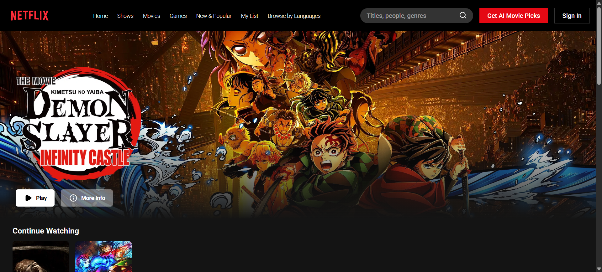
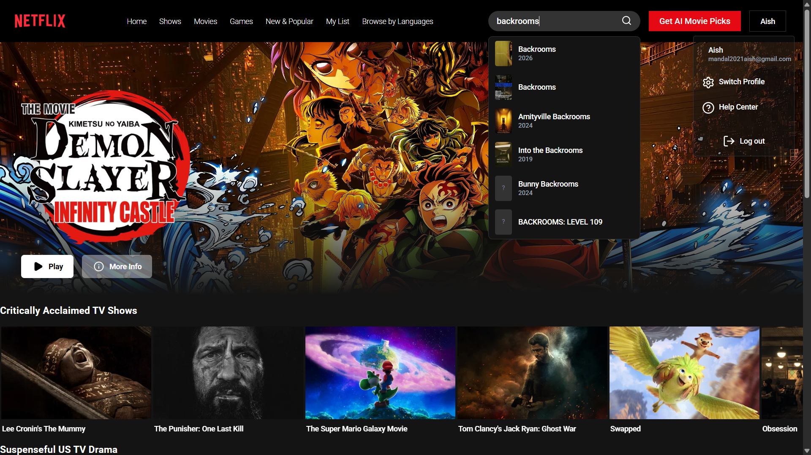

A full-stack Netflix-inspired movie browsing application built with the MERN stack. Features real-time movie data from TMDB, AI-powered recommendations via Groq, JWT-based authentication, and per-user watch history.

---

## Screenshots

### Auth Page

### Hero Banner

### Continue Watching

### Search and Navigation

### AI Recommendations


---

## Features

- User authentication with JWT stored in HTTP-only cookies
- Live movie data from the TMDB API across multiple categories (Now Playing, Top Rated, Popular, Upcoming)
- Dynamic hero banner with official movie title treatment logos fetched from TMDB
- Debounced live search with dropdown results and poster thumbnails
- Per-user watch history persisted in MongoDB, displayed as a Continue Watching row on the homepage
- AI-powered movie recommendations via Groq, driven by a user preference questionnaire
- Full movie detail pages with trailer embed, genre tags, production details, and similar movie recommendations
- Responsive layout supporting mobile and desktop viewports

---

## Tech Stack

### Frontend

| Tool | Purpose |
|------|---------|
| React + Vite | UI framework and build tool |
| Tailwind CSS | Utility-first styling |
| React Router | Client-side routing |
| Axios | HTTP client with global base URL configuration |
| Zustand | Lightweight global state management for auth |
| Swiper.js | Horizontal scrollable movie rows |
| Lucide React | Icon library |

### Backend

| Tool | Purpose |
|------|---------|
| Node.js + Express | REST API server |
| MongoDB + Mongoose | Database and schema modeling |
| bcryptjs | Password hashing |
| jsonwebtoken | Token generation and verification |
| cookie-parser | HTTP-only cookie handling |

### External APIs

| API | Purpose |
|-----|---------|
| TMDB API | Movie data, posters, trailers, and title logos |
| Groq API | Personalized AI movie recommendations |

---

## Project Structure

```
NETFLIXCLONE/
├── backend/
│   ├── config/
│   │   └── db.js
│   ├── models/
│   │   ├── user.model.js
│   │   └── watchHistory.model.js
│   ├── routes/
│   │   └── watchHistory.route.js
│   ├── .env
│   └── server.js
│
└── frontend/
    ├── pages/
    │   ├── Homepage.jsx
    │   ├── Moviepage.jsx
    │   ├── AiRecc.jsx
    │   ├── SignIn.jsx
    │   └── SignUp.jsx
    ├── src/
    │   ├── components/
    │   │   ├── Hero.jsx
    │   │   ├── CardList.jsx
    │   │   ├── Navbar.jsx
    │   │   └── Footer.jsx
    │   ├── App.jsx
    │   └── main.jsx
    └── stores/
        └── authStore.js
```

---

## Getting Started

### Prerequisites

- Node.js v18 or higher
- A MongoDB Atlas account
- TMDB API key ([register here](https://www.themoviedb.org/settings/api))
- Groq API key ([register here](https://console.groq.com/))

### Installation

**1. Clone the repository**

```bash
git clone https://github.com/05-aish/Netflic_Clone-AI.git
cd netflixclone
```

**2. Set up the backend**

```bash
cd backend
npm install
```

Create a `.env` file inside `/backend`:

```env
PORT=3001
MONGO_URI=your_mongodb_atlas_uri
JWT_SECRET=your_jwt_secret
CLIENT_URL=http://localhost:5173
NODE_ENV=development
GROQ_API_KEY=your_groq_api_key
```

Start the backend server:

```bash
node server.js
```

**3. Set up the frontend**

```bash
cd frontend
npm install
```

Create a `.env` file inside `/frontend`:

```env
VITE_API_URL=http://localhost:3001
```

Start the frontend:

```bash
npm run dev
```

The app runs at `http://localhost:5173`.

---

## Environment Variables

### Backend

| Variable | Description |
|----------|-------------|
| `MONGO_URI` | MongoDB Atlas connection string |
| `JWT_SECRET` | Secret key used for signing JWTs |
| `CLIENT_URL` | Frontend origin URL used for CORS |
| `NODE_ENV` | Set to `production` when deployed |
| `GROQ_API_KEY` | Groq API key |

### Frontend

| Variable | Description |
|----------|-------------|
| `VITE_API_URL` | Base URL of the backend API |

---

## Deployment

The frontend is deployed on [Vercel](https://netflix-clone-ai-lgg9-kr7q7fvg4.vercel.app/) and the backend is deployed on [Render](https://netflix-clone-ai.onrender.com).

### Frontend (Vercel)

1. Import the GitHub repository on Vercel
2. Set Root Directory to `frontend`
3. Add `VITE_API_URL` as an environment variable pointing to your Render backend URL
4. Deploy

### Backend (Render)

1. Create a new project on Render and connect the GitHub repository
2. Set Root Directory to `backend`
3. Add all required environment variables
4. Set `CLIENT_URL` to your Vercel frontend URL
5. Do not set `PORT` manually -- Render injects it automatically
6. Deploy

---

## Author

**Aishwarya**
Computer Science and Design Student
[GitHub](https://github.com/05-aish) · [LinkedIn](https://www.linkedin.com/in/aishwarya-mandal-6b79b6279/)

---

## License

This project is built for educational and portfolio purposes. Movie data is provided by [TMDB](https://www.themoviedb.org). This product uses the TMDB API but is not endorsed or certified by TMDB.
